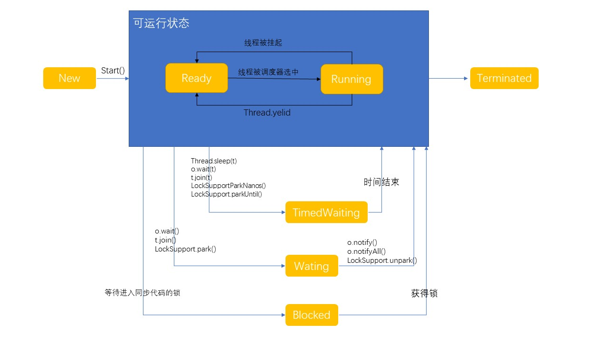

## 程序进程线程
- 程序：为完成特定任务、用某种语言编写的一组指令的集合。简单来说，就是我们所写的代码。
- 进程：运行中的程序，比如我们使用QQ,就启动了一个进程，操作系统就会为该进程分配内存空间。当我们使用迅雷，又启动了一个进程，操作系统将为迅雷分配新的内存空间。进程是程序的一次执行过程，或者是正在运行的一个程序。是动态过程：有他自身的产生、存在和消亡的过程。
- 线程：由进程创建，是进程的一个实体，一个进程可以拥有多个线程。
- 并发：同一时刻，多个任务交替执行，造成一种“貌似同时”的错觉，简单来说，单核cpu实现的多任务就是并发。
- 并行：同一个时刻，多个任务同时执行。多核cpu可以实现并行。并行里面也能出现并发。

## 线程的基本使用
在Java中线程使用有两种方法。
- 继承**Thread**类，重写**run**方法
- 实现**Runnable**接口，重写**run**方法

#### 继承Thread类
```java
import java.util.*;
class Cat extends Thread{
    @Override
    public void run(){
        //重写run方法，写入自己的逻辑。
        System.out.println("我都想笑了");
        //让线程休眠1秒
        try{
            Thread.sleep(1000);
        }catch (InterruptedException e){
            e.printStackTrace();
        }

    }
}

public class Test {
    public static void main(String[] args) {
        //创建一个Cat对象，可以当作线程使用
        Cat cat = new Cat();
        cat.start();
    }
}

```
当一个类继承了**Thread**类，那么这个类就可以当作一个线程类来使用。

**注意点**：Thread类的run方法实际上是去实现了**Runnable**接口中的run方法。

启动一个线程是不会阻塞主线程的，而且只是CPU在两个线程里面交替切换执行。

start方法会去启动cat的run方法，而run方法就是一个普通的方法，如果没有真正的启动一个线程，就会把run方法里面的代码执行，才向下执行。所以run方法并不是开启线程的真正方法

start方法调用start0方法后，该线程不一定会立马执行，只是将线程变成了可运行状态。具体什么时候执行，取决于CPU，由CPU统一调度。

#### 实现Runnable接口
因为java是单继承的，在某些情况下一个类可能已经继承了某个父类，这时就继承不了**Thread**类了。
```java
class Dog implements Runnable{
    int count = 0;
    @Override
    public void run(){
        while (true){
            count++;
            System.out.println("狗再叫");
            try{
                Thread.sleep(1000);
            }catch (InterruptedException e){
                e.printStackTrace();
            }
            if(count>=10) break;
        }
    }
}

public class Test {
    public static void main(String[] args) {
        Dog dog = new Dog();
        Thread thread = new Thread(dog);
        thread.start();
    }
}
```
其中底层实现了静态代理，所以需要像这样来开启线程。
```java
        Dog dog = new Dog();
        Thread thread = new Thread(dog);
        thread.start();
```
## 线程终止
- 线程完成任务之后自动退出。
- 通过通知的方式来让某个线程停止。

如果希望主线程能去控制子线程的终止，只需要修改某个变量使其终止即可
```java
class Dog implements Runnable{
    int count = 0;
    private boolean loop = true;
    @Override
    public void run(){
        while (loop){
            count++;
            System.out.println("狗再叫");
            try{
                Thread.sleep(1000);
            }catch (InterruptedException e){
                e.printStackTrace();
            }
            if(count>=10) break;
        }
    }
    public void setLoop(boolean t){
        this.loop = t;
    }
}

public class Test {
    public static void main(String[] args) {
        Dog dog = new Dog();
        Thread thread = new Thread(dog);
        thread.start();
        //由于子线程并不会干扰主线程。在这里设置loop为false即可阻断子线程运行。
        dog.setLoop(false);
    }
}
```

## 线程常用方法
线程有如下几种常用方法

| 方法名      | 含义                                                       |
| ----------- | ---------------------------------------------------------- |
| setName     | 设置线程名称，使之与参数 name 相同                         |
| getName     | 返回该线程的名称                                           |
| start       | 使该线程开始运行，JVM调用该线程的start0方法                |
| run         | 调用线程对象的run方法，执行run方法里面的代码               |
| setPriority | 设置线程优先级                                             |
| getPriority | 获得线程优先级                                             |
| sleep       | 线程休眠，暂停执行                                         |
| intterupt   | 中断线程                                                   |
| yield       | 线程让步                                                   |
| join        | 线程插队。插队线程一旦成功，则肯定执行完插入的线程所有任务 |


#### 线程中断interrupt演示

```java
class T extends Thread{
    @Override
    public void run(){
        while(true){
            for(int i = 0 ; i < 100 ; i ++){
                System.out.println(Thread.currentThread().getName()+"吃包子"+i);
            }
            try{
                System.out.println(Thread.currentThread().getName());
                Thread.sleep(10000);
            }catch (InterruptedException e){
                //如果线程被中断了，就会捕获到中断异常，从而执行catch语句块里面的代码
                System.out.println(Thread.currentThread().getName() + "被 interrupt了");
            }
        }
    }
}

public class Test  {
    public static void main(String[] args) throws Exception {
        T t = new T();
        t.start();
        //主线程打印5个hi，就中断 子线程的休眠
        for(int i = 0 ; i < 5 ;i++){
            Thread.sleep(1000);
            System.out.println("第"+i+"个hi");
        }
        t.interrupt();
    }
}
```
#### 线程插队join演示
实现这个案例：**线程main创建一个子线程，每隔1s输出一句hello，输出20次，主线程每隔1s，输出hi，输出20次。要求两个线程同时执行，当主线程输出5次后，就让子线程运行完毕，主线程再继续。**

```java
class T extends Thread{
    @Override
    public void run(){
        for(int i = 0 ; i < 20 ; i++){
            System.out.println("hello"+i);
        }
    }
}

public class Test  {
    public static void main(String[] args) throws Exception {
        T t = new T();
        t.start();
        for (int i = 0 ; i < 20 ;i++){
            if(i == 5) t.join(); //让线程t插队进来
            System.out.println("hi"+ i);
        }
    }
}
```

#### 守护线程演示
守护线程一般为了工作线程服务，当所有工作现场结束，守护线程也会自动结束，常见的守护线程：垃圾回收机制。


```java
class T extends Thread{
    @Override
    public void run(){
        for(int i = 0 ; i < 100 ; i++){
            System.out.println("hello"+i);
        }
    }
}

public class Test  {
    public static void main(String[] args) throws Exception {
        T t = new T();
        //如果希望主线程执行完毕之后，子线程立马自动结束
        //只需要把线程t设置为守护线程即可
        t.setDaemon(true); //线程.serDeamon(true)
        t.start();
        for (int i = 0 ; i < 10 ;i++){ //主线程
            System.out.println("执行..."+ i);
        }
    }
}
```
运行以上代码，你会发现t线程并没有执行完100次结束，而是提前结束了。


## 七大线程状态
在java中，一共有七种状态

| 状态         | 含义                     |
| ------------ | ------------------------ |
| New          | 初始化状态               |
| Ready        | 可运行状态。就绪         |
| Running      | 可运行状态。运行         |
| Terminated   | 终止状态                 |
| Blocked      | 等待进入同步代码块的锁。 |
| Waiting      | 等待状态。               |
| TimedWaiting | 超时等待状态。           |



## 线程同步机制
在多线程编程，一些敏感数据不允许被多个线程同时访问，此时就使用同步访问技术，保证数据在任何同一时刻，最多有一个线程访问，以保证数据的完整性。

也可以这么理解：线程同步，即当有一个线程在对内存进行操作时，其他线程都不可以对这个内存地址进行操作，直到该线程完成操作，其他线程才能对该内存地址进行操作。
